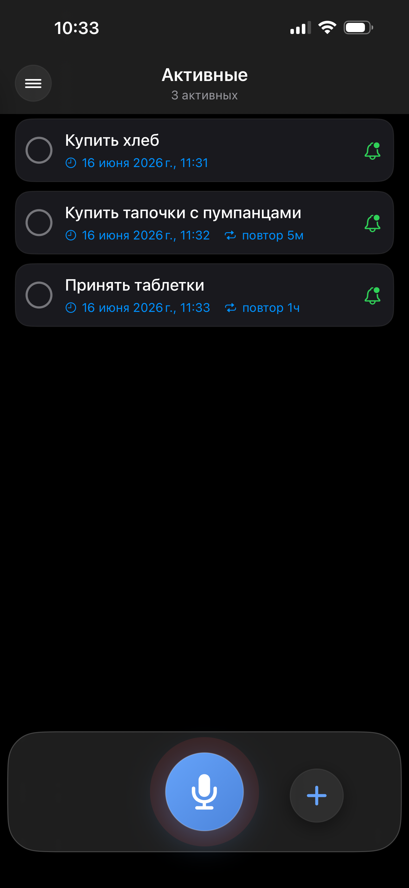
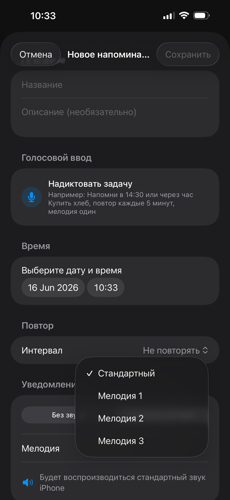

# Reminder-MKV v 1.1.0
Reminder MKV - самая простая и очень эффективная напоминалка без заморочек.

Мое первое iOS-приложение, созданное на Swift / SwiftUI.

## О проекте
Это приложение помогает не пропустить запланированные задачи. 
Деменция не приходит с годами, она живет в каждом из нас. 
Для установки потребуется esign и сертификат, в ближайшем будущем мы решим этот вопрос. 

## Функции
- Основной экран
- Активные, Завершенные задачи
- Push-уведомления
- Темная тема

## Что нового в версии 1.1.0
- добавлен голосовой ввод
- выбор нескольких звуков уведомлений
- отображение под напоминаниями времени повтора
- добавлены виджеты

## Технологии
- Swift
- SwiftUI
- Xcode
- iOS
 
## Скриншоты

  
 
  
  
  

## Статус
Проект в разработке.

## Планы
- улучшить UI
- добавить анимации
- подготовить релиз в App Store

## Автор
mkv.tb
